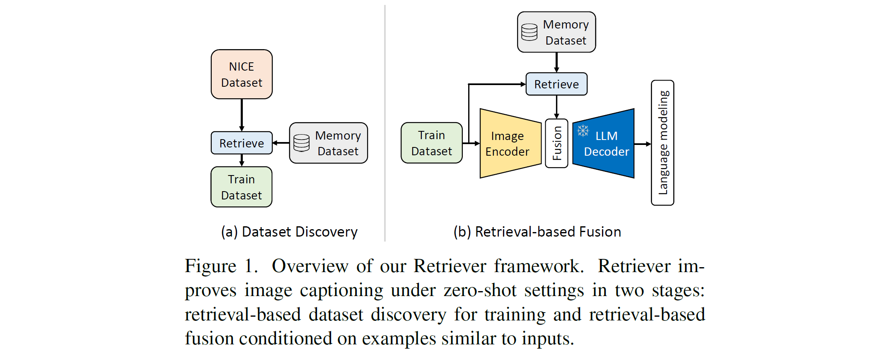

# Retrieval-based Data Discovery and Fusion for Zero-shot Image Captioning

A second place winning solution to the 2023 Challenge on zero-shot image captioning evaluation at [CVPR 2023 NICE Workshop](https://nice.lgresearch.ai/).


> Technical Report of NICE Challenge at CVPR 2023: Retrieval-based Data Discovery and Fusion for Zero-shot Image Captioning
> 
> [Youngtaek Oh](https://ytaek-oh.github.io), [Jae Won Cho](https://chojw.github.io/), [Dong-Jin Kim](https://sites.google.com/site/djkimcv/), [In So Kweon](http://rcv.kaist.ac.kr/index.php?mid=rcv_faculty), and [Junmo Kim](https://siit.kaist.ac.kr/Faculty)
> 
> Technical report [[pdf](https://ytaek-oh.github.io/assets/pdf/nice_report.pdf)]


## Abstract
This report introduces Retriever, our solution for the 2023 Challenge on zero-shot image captioning evaluation at the New Frontiers for Zero-Shot Image Captioning Evaluation (NICE) Workshop. Retriever efficiently improves image captioners by retrieving from an external memory of image-text pairs in two steps. First, a set of image-text pairs for training is fetched by applying explicit retrieval module to the intended target dataset. In addition, we fuse the knowledge associated with the input sample queried from the retrieval module during training and inference. With this complete framework, specific knowledge in captions can be easily incorporated into the captioner even in the absence of ground-truth captions, and the model can generate better captions conditioned on relevant knowledge from an external data source. Experimentally, Retriever improves the base image captioner by the CIDEr score by 229.4 in (held-out) validation data of NICE Challenge 2023 despite its simplicity. On the test data, notably, we ranked 2nd in CIDEr score, and 1st in all the other metrics.

<p align='center'>
  
</p>


## TODO

- [x] Upload codes
- [x] Documentation
- [x] Share technical report
- [x] Writing bash scripts for training and evaluation
- [x] Share FAISS index file, checkpoint, and logs

## Install

The code is tested with the following environment.
- Ubuntu 20.04
- CUDA 11.3
- Python 3.7
- PyTorch 1.12.1
- Quadro RTX 8000 (Mem: 45GB) *4 GPUs 


To install requirements, we provide a docker script with one-click installation of the dependencies for your convenience. 
```setup
git clone https://github.com/ytaek-oh/retriever.git && cd retriever/docker
docker build -t retriever:v0 .  # see Dockfile if needed.
./run_docker.sh
```

## Preprocessing
This paragraph includes the procedures for constructing (1) NICE and Shutterstock datasets, (2) Constructing FAISS index file as the memory dataset in the paper and following annotations from retrieval, (3) pre-computing retrieved caption features, and finally (4) annotations for training and testing. 

*NOTE. The path for the dataset is specified as ${DATA_PATH}. As a reference, our directory tree for the project is set as following for our environment, but this can be changed on your preference.*
```
./
  retriever/
    train.py
    ...
  datasets/  # ${DATA_PATH}
    nice/
      val/
      test/
      nice-val-5k.csv
    shutterstock/
      images/
      knn_storage/
      shutterstock.csv
```
<br />

1. Download the [NICE dataset](https://nice.lgresearch.ai/) on the `${DATA_PATH}/nice` directory. <br /><br />
2. Create annotations for the NICE val and test splits by executing `utils/create_nice_annotations.py` as following:
```
python utils/create_nice_annotations.py --data_path ${DATA_PATH}
```

- This gives `nice_val.json` and `nice_test.json` on  `${DATA_PATH}/nice`.
- Then, download the 4k-1k held-out train and valid splits based on the NICE 5k val split from [here](https://drive.google.com/drive/folders/11OonDbi9eN6WVMCZPMdZDN_yUZxVMBph?usp=sharing) to `${DATA_PATH}/nice`. <br /><br />

3. Download the list of Shutterstock image url and caption pairs from [here](https://github.com/mlfoundations/clip_quality_not_quantity) to `${DATA_PATH}/shutterstock`. Then preprocess the 1M of shutterstock dataset by following the instructions on [this notebook](./nice/datasets/download_scripts/DownloadShutterstockCaptions/shutterstock_preprocess.ipynb). 
- After completing all the procedures, `shutterstock1m.json` is generated on `${DATA_PATH}/shutterstock`. Please note that since the images are downloaded from the shutterstock server, the resulting images will not be exactly matched upon different trials.  <br /><br />


4. Please properly set the absolute paths for Shutterstock dataset from `nice/configs/datasets/shutterstock/shutterstock_1m.yaml`. Then to construct a FAISS index file that contains the shutterstock1m features, execute as following:
```
# Runs on DP, not DDP.
CUDA_VISIBLE_DEVICES=0,1,2,3 python faiss_construct.py \
    --cfg-path nice/configs/preprocessing/faiss/blip2_construct_shutterstock_1m.yaml \
    --options run.data_root ${DATA_ROOT}
``` 
- This takes approximately 7 hours with 4 GPUs, consuming less than 24GB VRAM per GPU. 
- This produces a FAISS index file named `shutterstock_1m` on `./output/faiss/construct_shutterstock_1m`. Please move it to `${DATA_PATH}/shutterstock/knn_storage`.  
- The resulting file processed by ours can be found [here](https://drive.google.com/drive/folders/11i0mryEzcYzSj7Vova9yORh5Vxwzau3M?usp=sharing), but the shutterstock indices might be slightly different depending on the downloaded Shutterstock dataset.
- Later, please make sure that the absolute paths are all correct in all the configuration files contained on `nice/configs/datasets`. <br /><br />

5. For each of the examples in the NICE splits, assign the indices of the shutterstock1m samples based on the constructed FAISS index file by executing following commands respectively. Please make sure that the variables for data path are correct for the following configuration files.
```
CUDA_VISIBLE_DEVICES=0 python faiss_assign.py \
    --cfg-path nice/configs/preprocessing/faiss/blip2_assign_shutterstock_1m_to_eval_data.yaml \
    --options run.data_root ${DATA_ROOT}
```
- This command gives `shutterstock_retrieval_nice_val.json` on `${DATA_PATH}/shutterstock`.

```
# After obtaining shutterstock_retrieval_nice_val.json,
CUDA_VISIBLE_DEVICES=0 python faiss_assign.py \
    --cfg-path nice/configs/preprocessing/faiss/blip2_assign_shutterstock_1m_to_discovery_data.yaml \
    --options run.data_root ${DATA_ROOT} 
``` 
- This command gives `discovery_nice_test_top1_ret_ids.json` on `${DATA_PATH}/nice` and `shutterstock_retrieval_discovery_nice_test_top1.json` on `${DATA_PATH}/shutterstock` respectively. <br /><br />

6.  To extract caption features for the retrieved examples from Shutterstock, 
```
python -m torch.distributed.run --nproc_per_node=1 --master_port=29502 extract_feats.py \
  --cfg-path nice/configs/preprocessing/qformer_extraction/qformer_feats_for_nice_eval.yaml \
  --options run.world_size 1 \
  run.data_root ${DATA_ROOT}
```
- This command gives `text_feature_nice_{val, test, discovery_top1}.h5` on `${DATA_PATH}/shutterstock/caption_features`. <br /><br />

7. Concatenate the NICE validation data (5k whole and held-out 4k respectively) with the discovered dataset.
```
# concatenate the full NICE 5k validation data with the data from
#    dataset discovery process with corresponding caption features.
python utils/concatenate_dataset_with_feature.py --data_root ${DATA_ROOT} \
    --anns_first ${DATA_ROOT}/nice/nice_val_ret_ids.json \
    --feats_first ${DATA_ROOT}/shutterstock/caption_features/text_feature_nice_val.h5 \
    --anns_second ${DATA_ROOT}/nice/discovery_nice_test_top1_ret_ids.json \
    --feats_second ${DATA_ROOT}/shutterstock/caption_features/text_feature_nice_discovery_top1.h5 \
    --anns_save_name discovery_nice_test_top1_add_valid5k_ret_ids.json \
    --feats_save_name text_feature_nice_discovery_top1_add_valid5k.h5

# concatenate the held-out NICE 4k validation data with the data from 
#    dataset discovery process.
python utils/concatenate_dataset_with_feature.py --data_root ${DATA_ROOT} \
    --anns_first ${DATA_ROOT}/nice/nice_val_split_train_ret_ids.json \
    --anns_second ${DATA_ROOT}/nice/discovery_nice_test_top1_ret_ids.json \
    --anns_save_name discovery_nice_test_top1_add_split4k_ret_ids.json
``` 

<br />

## Train
The cases for training dataset can include (1) held-out NICE validation 4k splits (supervised) *with or without retrieval-based fusion*, (2) samples from the dataset discovery process with Top-1 metric only (total **10901** samples) *with or without retrieval-based fusion*, (3) combination of held-out NICE validation **4k** splits and the discovered data (total **14901** samples) *with or without retrieval-based fusion*, and (4) combination of full NICE validation set and the discovered data (total **15901** samples) *with retrieval-based fusion only*, for submission to the test server.  Please refer to the training configurations for each cases on `nice/configs/train/blip2_vig_g_opt2.7b/`. Some example scripts for training are given as:

- Fine-tuning a BLIP-2 model only with the held-out 4k NICE splits:
```
# This corresponds to the results from Table 3 of the report as
# BLEU@1=50.1, SPICE=36.8, CIDEr=238.3 on the held-out 1k NICE validation split. 
python -m torch.distributed.run --nproc_per_node=4 train.py \
  --cfg-path nice/configs/train/blip2_vig_g_opt2.7b/nice_split_valid4k_supervised/supervised_baseline.yaml
```

- Training a model with the combination of 4k NICE splits and top1 discovered data (total 14901 samples) with retrieval-based fusion:
```
# This corresponds to the results from Table 3 of the report as
# BLEU@1=56.3, SPICE=42.7, CIDEr=309.0 on the held-out 1k NICE validation split. 
python -m torch.distributed.run --nproc_per_node=4 train.py \
  --cfg-path nice/configs/train/blip2_vig_g_opt2.7b/discovery_top1_add_valid4k_supervised/ret_fusion_visual_patch_emb_avg_top2.yaml
```

*Please note that the training requires total 4 GPUs with 45GB VRAM per GPU. To fit a 24GB VRAM GPUs, adjusting the batch sizes for training and evaluation would be necessary.*


## Evaluation
Please check the variable  `test_splits` for the following config files. 
- Inference on a pretrained BLIP-2:
```
# an evaluation script for the model without ret-based fusion.
python -m torch.distributed.run --nproc_per_node=4 evaluate.py \
  --cfg-path nice/configs/eval/blip2_vig_g_opt2.7b/nice_eval_default.yaml \
  --options run.output_dir ${OUTPUT_DIR} \
  model.load_finetuned False model.load_pretrained True
```

- Inference on a model with the retrieval-based fusion applied: 
```
python -m torch.distributed.run --nproc_per_node=4 evaluate.py \
  --cfg-path nice/configs/eval/blip2_vig_g_opt2.7b/nice_eval_retrieval_fusion.yaml \
  --options run.output_dir ${OUTPUT_DIR} \
  model.ret_k 2 \
  run.load_checkpoint ${CHECKPOINT_DIR}
  ```


## Training logs, evaluated captions and checkpoints
We release the training logs and some checkpoints for the results on tables of our technical report [here](https://drive.google.com/drive/folders/12-0UOFBhdMGJ2nmqM8-3-SL7olF154Uv?usp=sharing). The results from Table 3 include corresponding checkpoints.


## Acknowledgements

This project inherits the architecture of the [lavis](https://github.com/salesforce/LAVIS) project from Salesforce.


## Citation
If you find our work useful for your research, please cite with the following bibtex:
```bibtex
@article{ohtechnical,
  title={Technical Report of NICE Challenge at CVPR 2023: Retrieval-based Data Discovery and Fusion for Zero-shot Image Captioning},
  author={Oh, Youngtaek and Cho, Jae Won and Kim, Dong-Jin and Kweon, In So and Kim, Junmo},
  note={\url{https://ytaek-oh.github.io/assets/pdf/nice_report.pdf}}
}
```
